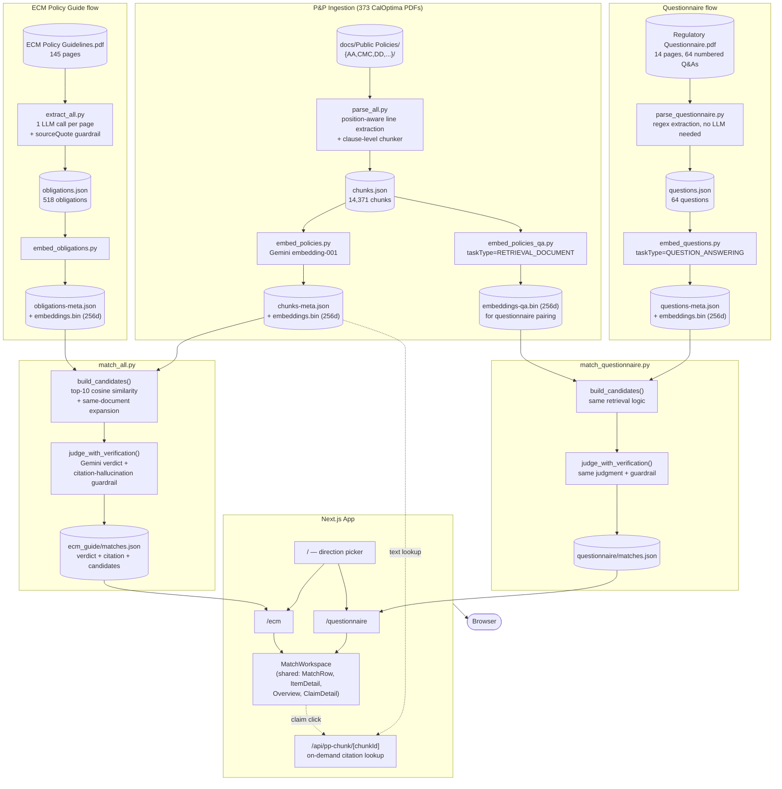

# Readily Compliance Module

A tool for Alex, a Medi-Cal managed care compliance analyst, who spends days manually
cross-referencing regulatory requirements against her plan's Policy & Procedure (P&P)
documents — first to catch gaps before a DHCS Policy Guide update creates a finding, and
again every time a Submission Review Form questionnaire arrives. This module automates
both checks: extract every discrete regulatory requirement, retrieve the P&P language
most likely to address it, and have an LLM judge whether it's actually covered,
partially covered, contradicted, or missing — with every judgment traceable back to a
verified citation.

## What it does

Two parallel flows, same underlying pipeline:

1. **P&P vs. ECM Policy Guide** — 518 obligations extracted from a 145-page DHCS Policy
   Guide, each checked against the plan's 373 P&P documents.
2. **P&P vs. Submission Review Form** — 64 yes/no compliance questions from a real DHCS
   questionnaire, checked the same way.

Each item gets one of four verdicts:

| Verdict | Meaning |
|---|---|
| **Covered** | A P&P excerpt explicitly states the requirement |
| **Partial** | Related P&P language exists, but only via inference — needs manual review |
| **Conflict** | A P&P excerpt actively contradicts the requirement |
| **Gap** | No existing P&P language addresses it |

## System architecture



## Directory structure

```
scripts/                   Python ingestion/matching pipeline (offline, run manually)
  lib/
    pdf_utils.py            P&P PDF line extraction (position-aware, for the templated P&P layout)
    chunker.py               Clause-level chunking (outline-aware: I./A./1./a. numbering)
    narrative_pdf.py         Flat text extraction for the narrative Policy Guide
    questionnaire_pdf.py     Regex extraction for the structured Submission Review Form
    gemini_client.py         Embeddings + structured-output judgment calls (plain REST, no SDK)
    match_helpers.py         Citation-hallucination guardrail (judge_with_verification)
    vectors.py                Cosine similarity / top-K retrieval helpers
  parse_all.py, embed_policies.py, embed_policies_qa.py    P&P ingestion
  extract_all.py, embed_obligations.py                      ECM Policy Guide obligation extraction
  parse_questionnaire.py, embed_questions.py                 Questionnaire parsing
  match_all.py, match_questionnaire.py                       Matching + verdict judgment
  repair_ecm_matches.py, add_candidates.py                   One-off backfill/repair scripts

data/
  plan_policies/    P&P chunks + two embedding sets (untagged, and RETRIEVAL_DOCUMENT for Q&A)
  ecm_guide/         Obligations + matches
  questionnaire/     Questions + matches

src/
  app/
    page.tsx                Screen 1: direction picker
    ecm/page.tsx             Screen 3: ECM obligations workspace
    questionnaire/page.tsx  Screen 3: questionnaire workspace
    api/pp-chunk/[chunkId]/ Citation text lookup route
  components/                Shared workspace UI (MatchWorkspace, MatchRow, ItemDetail, Overview, ClaimDetail)
  lib/
    data.ts                  Server-side data loading, normalized MatchItem shape
    verdict.ts                Verdict labels/colors
```

## Key design decisions

- **Clause-aware chunking, not fixed-size.** P&P chunks follow the documents' own outline
  structure (`II.A.1`); numbered items absorb their lettered/roman sub-items as context
  rather than being split arbitrarily.
- **One LLM call per page for obligation extraction, not batched.** Batching multiple
  Policy Guide pages per call caused the model to misattribute content across pages;
  per-page calls made page attribution deterministic instead of inferred.
- **Asymmetric task-type embeddings for the questionnaire.** Questions are embedded with
  `taskType=QUESTION_ANSWERING`; the P&P chunks get a *separate* embedding pass tagged
  `RETRIEVAL_DOCUMENT` specifically to pair with them — Gemini trains these as matched
  pairs, so mixing tagged and untagged embeddings would partially waste the benefit.
- **Retrieval narrows candidates; only the LLM judges them.** Embeddings can't
  distinguish support from contradiction — `"must respond within 14 days"` vs. `"within
  30 days"` score 0.98 cosine similarity despite being opposite requirements. Retrieval
  (top-10 + same-document expansion) only narrows the field; the actual supports /
  partial / contradicts / gap call is always made by reading the text.
- **Citation-hallucination guardrail.** The LLM can occasionally cite a real P&P chunk
  that was never actually in its candidate set for that call. `judge_with_verification()`
  checks every citation against what was actually shown, retries on failure, and flags
  `citationVerified: false` (surfaced in the UI) rather than silently trusting an
  unconfirmed citation.
- **"Run" loads precomputed results, it doesn't re-run the pipeline live.** All matching
  is a batch process (the full 518-obligation run takes ~15-20 minutes); the UI reads
  its output rather than re-invoking Gemini on every click.

## Running locally

```bash
npm install
npm run dev
```

The app reads precomputed data from `data/`. To regenerate it from scratch (requires
`GEMINI_API_KEY` in `.env.local`):

```bash
cd scripts
pip install -r requirements.txt

python3 parse_all.py && python3 embed_policies.py && python3 embed_policies_qa.py
python3 extract_all.py && python3 embed_obligations.py
python3 parse_questionnaire.py && python3 embed_questions.py
python3 match_all.py
python3 match_questionnaire.py
```

## Current results

| | Items | Covered | Partial | Gap | Conflict |
|---|---|---|---|---|---|
| ECM Policy Guide | 518 obligations | 240 | 158 | 103 | 17 |
| Submission Review Form | 64 questions | 12 | 26 | 23 | 3 |

## Deliberately not built

- **Live re-computation.** Re-running the LLM matching on every "Run" click would cost
  real time/money per view; the current design treats matching as a batch job.
- **Embedded PDF viewer.** Originally planned; replaced with a text-citation panel due to
  local disk constraints during development — a permanent simplification, not a stub.
- **Questionnaire upload/ingestion in the UI.** Both flows currently work off pre-ingested
  data; there's no in-app "upload a new Policy Guide or questionnaire" path yet.
